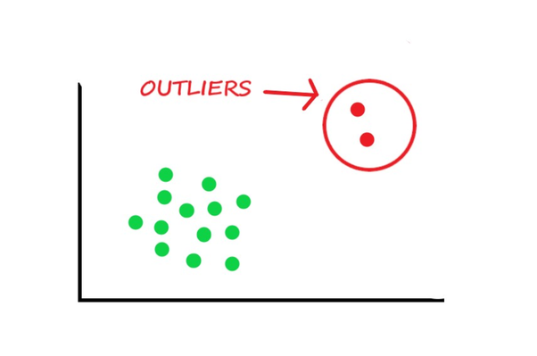
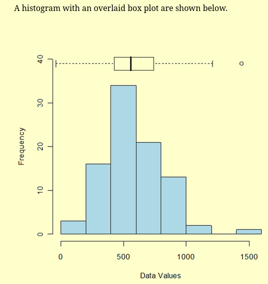

## What is a outlier? 

An outlier is an observation that lies an abnormal distance from other values in a random sample from a population. In a sense, this definition leaves it up to the analyst (or a consensus process) to decide what will be considered abnormal. Before abnormal observations can be singled out, it is necessary to characterize normal observations. 

## Ways to describe data 

1. Examination of the overall shape of the graphed data for important features, including symmetry and departures from assumptions. The chapter on Exploratory Data Analysis (EDA) discusses assumptions and summarization of data in detail.

2. Examination of the data for unusual observations that are far removed from the mass of data. These points are often referred to as outliers. Two graphical techniques for identifying outliers, scatter plots and box plots, along with an analytic procedure for detecting outliers when the distribution is normal (Grubbs' Test), are also discussed in detail in the EDA chapter. 

## A very important graph for detection of outliers in univariate context

### Box Plot construction 

The box plot is a useful graphical display for describing the behavior of the data in the middle as well as at the ends of the distributions. The box plot uses the median and the lower and upper quartiles (defined as the 25th and 75th percentiles). If the lower quartile is Q1 and the upper quartile is Q3, then the difference (Q3 - Q1) is called the interquartile range or IQ. 

### Box Plot with Fences 

A box plot is constructed by drawing a box between the upper and lower quartiles with a solid line drawn across the box to locate the median. The following quantities (called fences) are needed for identifying extreme values in the tails of the distribution: 

1. lower inner fence: Q1 - 1.5*IQ
2. upper inner fence: Q3 + 1.5*IQ
3. lower outer fence: Q1 - 3*IQ
4. upper outer fence: Q3 + 3*IQ 

Remember, IQ comes from InterQuartile Range, which is defined as the difference between Q3 and Q1.

## Outlier detection criteria using boxplots 

A point beyond an inner fence on either side is considered a mild outlier. A point beyond an outer fence is considered an extreme outlier. Here a example: 

